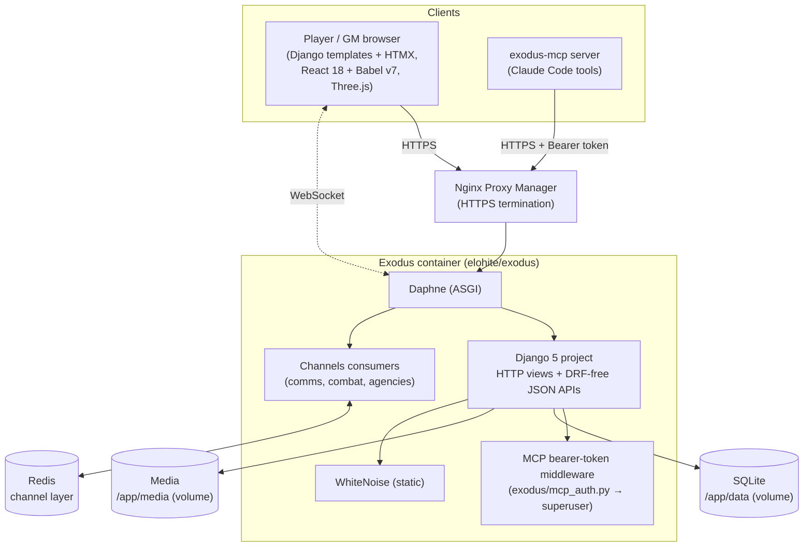

# Architecture

High-level shape of Exodus — the companion web app for a World of Darkness 2.0 space campaign. For per-app detail see the [project map](README.md#project-map); for *why* things are the way they are, see the [ADRs](docs/adr/).

## Container view

## How a request flows

- **Page loads** are server-rendered Django templates. Interactive surfaces (character sheet, agency sheet, star map, settings) hydrate with **React 18 compiled in-browser by Babel standalone (pinned v7)** — no build step — or with **HTMX** for lighter dynamic bits. The 3D star map uses **Three.js**.
- **Data** moves over plain JSON endpoints (no DRF) under each app's `api/...` routes, plus standard Django form POSTs. Serialization is hand-written in each app's `serializers.py`.
- **Real-time** (new comms messages, live combat/agency updates) goes over **WebSockets** to Channels consumers, which fan out through the **Redis** channel layer.
- **GM/automation** can hit the same JSON APIs with a bearer token; `MCPTokenAuthMiddleware` authenticates those as a superuser and exempts CSRF, which is how `exodus-mcp` reads/writes live data.

## State & configuration

- **SQLite** is the single source of truth, a file on a Docker volume ([ADR-0001](docs/adr/0001-sqlite-single-file-database.md)). No external DB.
- **Singletons** `SiteSettings` and `BaseConfig` (both `pk=1` with a `load()` classmethod) hold GM-tunable config: feature/tech gates (star map, public map, FTL jumps), the scanning turn/economy knobs, base costs, nav labels, the game date, and the charter.
- **JSON fields** carry flexible per-entity data throughout (character attributes/skills, agency attributes/fleet/projects, base facilities, system resources, scan readouts).
- **Context processors** (`exodus/context_processors.py`) expose version, changelog, game date, unread-message count, and map-visibility flags to every template.

## Notable subsystems

- **Star map & star-intel** (`starmap`): a 3D map plus an agency-intelligence game — per-agency private scan databases, observatory-driven dice rolls, an accumulating *uncertainty* model ([ADR-0003](docs/adr/0003-star-intel-scanning-model.md)), a contributable public record with disinformation, and a read-only public map. `StarSystem` holds GM ground truth (resources, `has_livable_planet`, `discovered`, `difficulty_mod`).
- **Starships & FTL** (`starships`): ship types → modules → classes → hulls, with a costed **FTL jump** economy ([ADR-0004](docs/adr/0004-ftl-jump-economy.md)) — jumps spend hull condition, or (when enabled) an agency fuel/spares stockpile refilled by extracting system resources.
- **Combat** (`combat`, `spacebattle`): WoD 2.0 personal/tactical combat and space battles, with live WebSocket updates.
- **GM workspace** (`gm_workspace`): superuser tools at `/gm/` including the **star-intel oversight** page that exposes every agency's true scan accuracy and any planted disinformation.

## Deployment

Single container behind Nginx Proxy Manager on ZimaOS. CI builds `elohite/exodus:<version.txt>` on push to `main` (running the full test suite + migrations on a fresh DB first), and the image is deployed by updating the tag. Front-end CDN dependencies are version-pinned to avoid silent breakage ([ADR-0005](docs/adr/0005-version-pinned-cdn-dependencies.md)).
